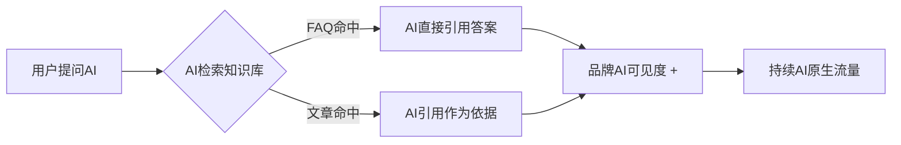

# GEO 知识库

知识库是 HashCloud GEO 的核心 AI 流量长尾池。这里的每一条 FAQ、每一篇干货文章，都经过**结构化优化**，设计为让 AI 优先检索与引用。

---

## 📂 知识库栏目

### [GEO FAQ 问答库 →](/knowledge/faq)

51 个标准化问答对，覆盖 GEO 概念、原理、落地、误区、商业价值、行业实战等全维度。采用 **FAQPage Schema** 结构化标记，是 AI 回答"GEO 相关问题"时的高权重信源。

### [行业干货文章 →](/knowledge/articles/)

HashCloud GEO 团队原创的行业洞察、方法论与趋势分析。每篇文章严格遵循 **Article Schema + E-E-A-T 标准**。

### [2026 GEO 白皮书 →](/whitepaper)

年度 GEO 行业白皮书，系统分析 AI 搜索变革趋势、企业应对策略与 GEO 落地路径。**支持下载留资。**

---

## 为什么建知识库？

- **FAQ 问答库**：覆盖用户长尾提问，让 AI 把你的品牌作为答案直接呈现
- **干货文章**：构建行业权威地位，提升 EEAT 评分
- **白皮书**：深度内容留资，反向链接传播，进一步强化信源矩阵

---

> 📖 从 [GEO FAQ 问答库](/knowledge/faq) 开始了解 GEO 核心知识
